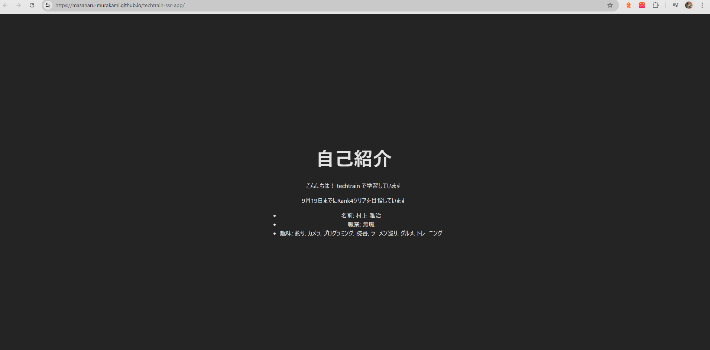
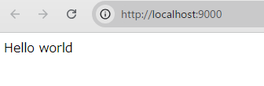
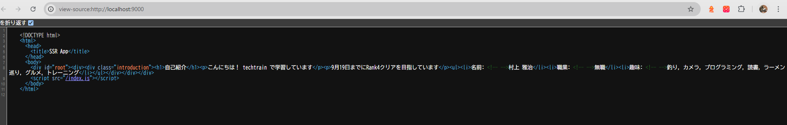

---
2024/09/14 15 時 21 分 github pages にデプロイ完了
やったこと
・ブラウザのキャッシュのクリア
・Branch の変更
GitHub Pages の Brunch を main から gh-pages に変更


---

---

# Station3 http://localhost:9000/ にアクセスで Hello,world 表示完了



---

# station4 サーバサイドのコードを webpack でビルド と babel を通してビルド 完了

purae@DESKTOP-F2KDNRM MINGW64 ~/Desktop/techtrain-SSR-App (main)
$ npm run build:server

> techtrain-ssr-app@0.0.0 build:server
> webpack --config webpack.server.config.js

asset bundle.js 609 KiB [compared for emit] [minimized] (name: main) 1 related asset
runtime modules 211 bytes 2 modules
cacheable modules 826 KiB
javascript modules 564 KiB 131 modules
json modules 262 KiB
modules by path ./node_modules/iconv-lite/ 86.7 KiB
./node_modules/iconv-lite/encodings/tables/shiftjis.json 8.78 KiB [built] [code generated]
./node_modules/iconv-lite/encodings/tables/eucjp.json 15.1 KiB [built] [code generated]
./node_modules/iconv-lite/encodings/tables/cp936.json 20.1 KiB [built] [code generated]
./node_modules/iconv-lite/encodings/tables/gbk-added.json 909 bytes [built] [code generated]
./node_modules/iconv-lite/encodings/tables/gb18030-ranges.json 2.17 KiB [built] [code generated] + 3 modules
./node_modules/statuses/codes.json 1.51 KiB [built] [code generated]
./node_modules/mime/types.json 30.8 KiB [built] [code generated]
./node_modules/mime-db/db.json 143 KiB [built] [code generated]

- 16 modules

WARNING in ./node_modules/express/lib/view.js 81:13-25
Critical dependency: the request of a dependency is an expression
@ ./node_modules/express/lib/application.js 22:11-28
@ ./node_modules/express/lib/express.js 18:12-36
@ ./node_modules/express/index.js 11:0-41
@ ./server/index.js 3:38-56

1 warning has detailed information that is not shown.
Use 'stats.errorDetails: true' resp. '--stats-error-details' to show it.

webpack 5.94.0 compiled with 1 warning in 3227 ms

purae@DESKTOP-F2KDNRM MINGW64 ~/Desktop/techtrain-SSR-App (main)
$ node dist/bundle.js
Server is running at http://localhost:9000

---
# staion５ SSR 完成


---

# React + TypeScript + Vite

This template provides a minimal setup to get React working in Vite with HMR and some ESLint rules.

Currently, two official plugins are available:

- [@vitejs/plugin-react](https://github.com/vitejs/vite-plugin-react/blob/main/packages/plugin-react/README.md) uses [Babel](https://babeljs.io/) for Fast Refresh
- [@vitejs/plugin-react-swc](https://github.com/vitejs/vite-plugin-react-swc) uses [SWC](https://swc.rs/) for Fast Refresh

## Expanding the ESLint configuration

If you are developing a production application, we recommend updating the configuration to enable type aware lint rules:

- Configure the top-level `parserOptions` property like this:

```js
export default tseslint.config({
  languageOptions: {
    // other options...
    parserOptions: {
      project: ["./tsconfig.node.json", "./tsconfig.app.json"],
      tsconfigRootDir: import.meta.dirname,
    },
  },
});
```

- Replace `tseslint.configs.recommended` to `tseslint.configs.recommendedTypeChecked` or `tseslint.configs.strictTypeChecked`
- Optionally add `...tseslint.configs.stylisticTypeChecked`
- Install [eslint-plugin-react](https://github.com/jsx-eslint/eslint-plugin-react) and update the config:

```js
// eslint.config.js
import react from "eslint-plugin-react";

export default tseslint.config({
  // Set the react version
  settings: { react: { version: "18.3" } },
  plugins: {
    // Add the react plugin
    react,
  },
  rules: {
    // other rules...
    // Enable its recommended rules
    ...react.configs.recommended.rules,
    ...react.configs["jsx-runtime"].rules,
  },
});
```
